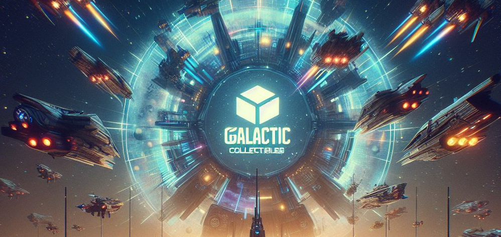

# Galactic Collectibles DApp




Welcome to Galactic Collectibles, a decentralized application (DApp) running on the Ethereum blockchain. This platform is dedicated to the creation, trading, and management of unique planets within a vibrant galactic ecosystem. This README serves as a comprehensive guide, providing insights into the application's overview, features, setup instructions, and smart contract details.

## Table of Contents

- [Introduction](#introduction)
- [Features](#features)
- [Getting Started](#getting-started)
- [Usage](#usage)
- [Smart Contract Details](#smart-contract-details)
- [Contributing](#contributing)
- [License](#license)

## Introduction

Galactic Collectibles is a decentralized application that leverages Ethereum smart contracts to streamline the creation, trading, and management of unique planets within a dynamic virtual galaxy. Each planet possesses distinct characteristics, including name, terrain, rarity level, owner, status, and price. Users can deploy the Galactic Collectibles smart contract, create planets, buy/sell planets, and engage in various planetary actions.

## Features

- **Deploy Contract:** Effortlessly deploy the Galactic Collectibles smart contract on the Ethereum blockchain.
- **Create Planet:** Users can craft unique planets by specifying details such as name, terrain, rarity level, and a unique identifier.
- **Buy/Sell Planets:** Facilitate planet transactions by putting them up for sale, purchasing from other users, or exchanging with fellow collectors.
- **Burn Planet:** Permanently remove a planet from the galactic ecosystem.
- **Transfer Planet:** Change ownership of a planet by transferring it to another Ethereum address.
- **Look Up Planet Info:** Retrieve detailed information about a planet using its unique identifier.
- **Real-time Events:** Stay updated with real-time application changes triggered by smart contract events, including planet creation, sale, exchange, transfer, and burning.

## Getting Started

Follow these steps to set up and run the Galactic Collectibles DApp on your local environment:

1. **Clone the repository:**

   ```bash
   git clone https://github.com/rezaiyan/galactic-collectibles-dapp.git
   cd galactic-collectibles-dapp
   ```

2. **Install dependencies and run the project:**

   Terminal1:
   ```bash
   cd app/
   npm install
   npm start
   ```

   Terminal2:
   ```bash
   npm install
   npx hardhat compile
   npx hardhat run ./tasks/deploy.ts --network localhost
   npx hardhat node
   ```

3. **Access the DApp in your web browser at `http://localhost:3000`.**
   Alternatively, set up for the Sepolia testnet:

   - **Create a `.env` file in the project root and provide your Ethereum node endpoint:**
     ```env
     INFURA_PROJECT_ID=YOUR_INFURA_API_KEY
     MNEMONIC=YOUR_METAMAST_MNEMONIC
     ```
   - **Run the following command:**
     Terminal2:
     ```bash
     npx hardhat run ./tasks/deploy.ts --network sepolia
     ```

## Usage

Embark on an exciting journey in the Galactic Collectibles universe with the following actions:

- **Deploy Contract:**
  - Click on the "🚀 Deploy Galactic Collectibles Contract" button.
  - Confirm the deployment transaction in your wallet.

- **Create Planet:**
  - Ensure the contract is deployed.
  - Click on "🪐 Create Your Own Planet" and provide the required details.
  - Confirm the transaction in your wallet.

- **Buy/Sell Planets:**
  - Put a planet up for sale using "🛍️ Put Your Planet For Sale."
  - Purchase a planet using "💸 Buy a Planet."

- **Burn Planet:**
  - Click "🔥 Burn Planet" to permanently remove a planet.

- **Transfer Planet:**
  - Transfer ownership of a planet using "🌌 Transfer Your Planet."

- **Look Up Planet Info:**
  - Obtain information about a planet using "🔍 Look Up Planet Info."

- **Exchange Planets:**
  - Swap two planets' ownership with "🔄 Exchange Planets."

## Smart Contract Details

The smart contract, based on the GalacticCollectibles.sol file, manages the creation, ownership, and actions related to planets within the Galactic Collectibles ecosystem. It emits events for various actions, allowing real-time updates in the DApp.

## Contributing

Contributions to Galactic Collectibles are welcome! Please follow the [contribution guidelines](CONTRIBUTING.md).

## License

This project is licensed under the [MIT License](LICENSE). Feel free to use, modify, and distribute the code.

Embark on an exciting journey in the Galactic Collectibles universe! 🚀🪐

## Acknowledgments

The React part of this project was inspired by the [hardhat-ethers-react-ts-starter](https://github.com/ChainShot/hardhat-ethers-react-ts-starter) template. A heartfelt thank you to the creators and contributors of that project for providing a valuable starting point and inspiration.

🙏 Thank you!